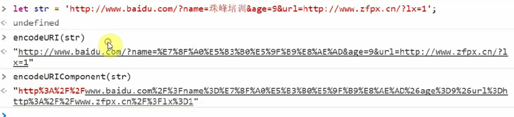
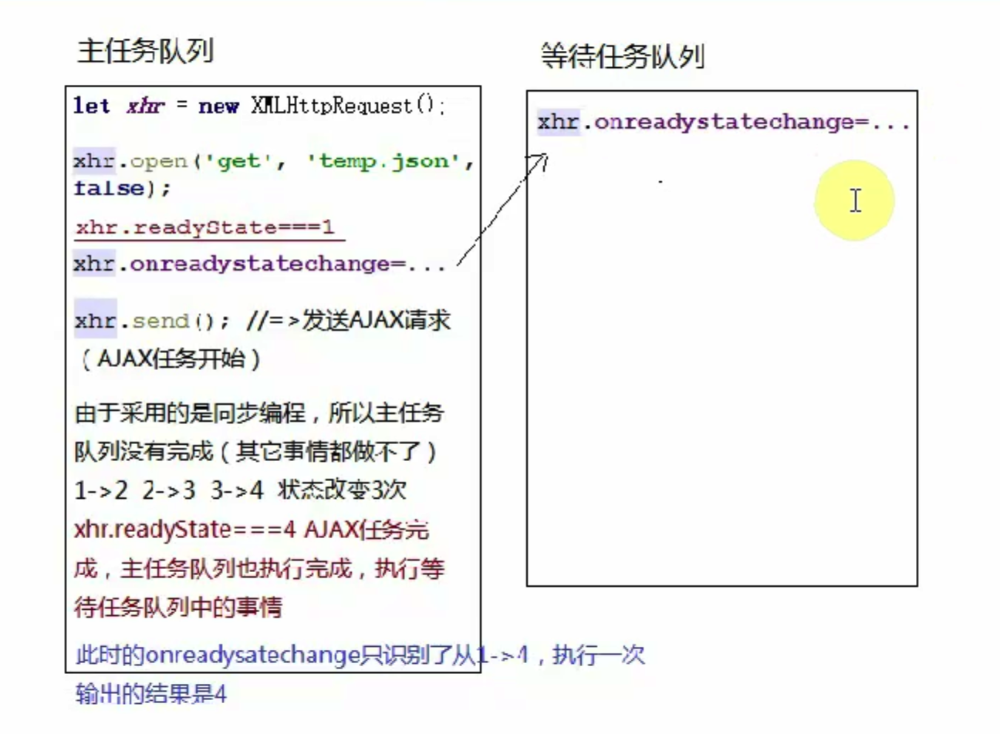
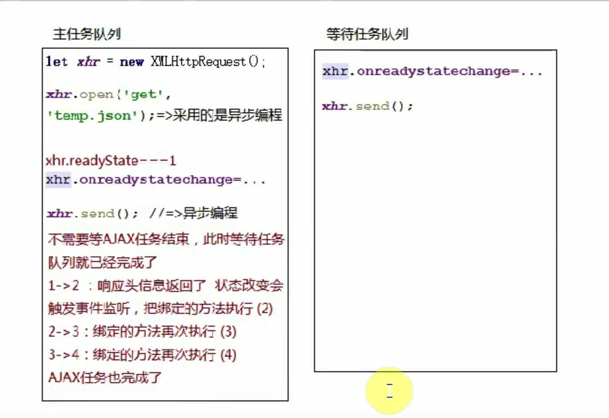

## AJAX核心原理
@(20180806)
### AJAX基础知识
> async javascript and xml 异步的js与xml

`xml：可扩展的标记语言`
> 作用是用来存储数据的（通过自己扩展的标记名称清晰的展示数据结构）
```xml
<?xml version="1.0" encoding="UTF-8"?>
<kuzi>
    <test>
        haha
    </test>
</kuzi>
```
> 现在ajax一般用json传输数据
> 这里的异步不是只能异步，虽然建议异步，异步在此特指 **异步刷新**
> 全局刷新优势
+ 1.动态展示的页面在源代码中可以看见，有利用seo推广（搜索引擎的抓取和收录）
+ 2. 从服务器获取最终页面无需客户端处理，在服务器性能好的前提下，页面加载速度快，淘宝 京东首屏页面都是服务器端渲染的
> 全局刷新弊端
+ 实时刷新无法实现
+ 服务器端处理量大，处理不过来 速度会更慢 京东淘宝其他屏都是客户端渲染绑定
+ 不利于开发
> 前后端分离,页面中需要动态绑定的数据ji交给服务端完成渲染
+ 向服务器发送ajax请求
+ 把从服务器获取的数据进行处理，拼接成为我们需要展示的字符串
+ 把拼接好的字符串替换页面中某一部分d的内容，局部刷新
> 优点
> 1. 根据需求局部刷新，性能好，整体不刷新
> 2. 利于开发 提高开发效率
> 1) 前后端完全分离
> 2) 同时开发，制定接口文档（接口 协议规范） 前端用node模拟
> 弊端：
> 1. 不利于seo 第一次从服务器获取的内容不包含需要动态绑定的数据，所以页面的原代码中没有这些数据,不利于seo,
> 后期通过js添加到页面中不会显示在源代码中
> 2. 异步ajax请求数据，再绑定数据，浏览器把加载的部分重新渲染,浪费时间，没有服务器端呈现速度快

### 基于原生js实现AJAX

```javascript
// 创建一个ajax对象
let xhr =  new XMLHttpRequest()//不兼容IE6及更低版本（ie6:ActiveObject）
// 打开请求地址
xhr.open([method],[url],[async],[user name],[password])
// 监听ajax状态改变，获取响应信息（响应头 响应主体）
xhr.onreadystatechange = ()=>{
	if (xhr.readyState ==4 && xhr.status ==200){
		let result = xhr.responseText // 获取响应主体
	}
}
// 发送ajax请求（传递请求主体）
xhr.send(null)
```

`第二步中的细节点`
> xhr.open([method],[url],[async],[user name],[password])
> AJAX请求方式
> 1. GET系列请求
> - get
> - delete： 从服务器上删除某些资源文件
> - head： 只想获取服务器返回的响应头信息（响应主体内容不需要获取）
...
> 2. POST系列请求
> - post
> - put :像服务器增加指定的资源 
> ...
>
> 不管哪一种请求方式，客户端都可以把信息传递给服务器，服务器也可以把信息返回给客户端。知识get系列以获取为主，post一般以推送为主
> 1)我们想获取一些动态信息的展示，一般使用GET请求，只需向服务器发送请求，告诉服务端想要什么，服务端就会把需要的数据返回
> 2）在实现注册功能的时候，需要把客户输入的信息发送给服务器进行存储，服务器一般返回成功还是失败装填，此时基于post
#### GET系列请求与POST系列请求，区别：
+ 1.get请求传递给服务器的内容没有post请求传递给服务器的内容多
> 原因： get请求传递给服务器内容一般都是基于`url地址传参`来实现的，而post请求一般都是基于`设置请求主体`来实现的。
各大浏览器都有自己的URL最大长度限制（chrome:8KB, FIREFOX:7KB; IE:2KB）
超过限制长度的部分，浏览器会自动截取掉，导致传递给服务器的数据丢失<br/>
> 理论上POST请求通过请求主体传递是没有大小限制的，真实项目中为了保证传输的速率，w我们也会限制大小（图片）
+ 2.get容易出现缓存，一般不可控，且不需要；post不会出现缓存，除非做特殊处理
> 原因：url传参会有缓存，设置请求主体不会
> 解决方案：在每一次重新请求的时候，url末未追加随机数，可避免从缓存中读取数据
```javascript
$.ajax({
    url: 'getList?lx=news&_='+Math.random(),
    success: result=> {	
    }
})
```
+ get没有post安全 post相对安全
> url劫持 信息泄露
 ### > xhr.open([method],[url],[async],[user name],[password])各参数含义
 - url：请求数据的地址
 - ASYNC: 异步，不写默认为异步, false->同步
 - 用户名和密码一般不用，如果请求的服务器设置了权限，需要提供（一般服务器允许匿名访问）
 
 ### onreadystatechange
 > ajax状态码： 描述当前ajax操作状态的
 > readyState
 - 0: UNSEND 未发送，只要创建一个ajax对象，默认值就是0
 - 1: OPENED 已经执行了xhr.open操作
 - 2: HEADERS_RECEIVED 当前ajax请求已经发送，并且已经接收到服务器返回的响应头信息
 - 3: LOADING 响应主体内容正在返回的路上
 - 4: DONE 响应主体内容已经返回
 > HTTP网络状态码 记录了当前服务器的返回状态 xhr.status
 - 200
 - 301永久重定向 
 - 302临时重定向 一般用于负载均衡(一般图片请求出现302，很多公司都有单独的图片服务器) 
 - 304 not modified 从浏览器缓存中获取数据 不常更新的文件 提高页面加载速度，减轻服务器压力
 - 4 开头一般都是失败，而且客户端的问题偏大
 - 400 请求参数不存在
 - 401 无权限
 - 404 访问地址不存在
 - 500 Internal server error 位置服务器错误
 - 503 service unavailable 服务器超负载
 
 ### AJAX中其他的属性和方法
 > 面试题：AJAX中总共支持几个方法
 ```javascript
let xhr = new XMLHttpRequest()
console.dir(xhr)
```
> [属性]
> - readyState: 存储的是当前ajax的状态码
> - response/responseText/responseXML 都是用来接收服务器返回的响应主体内容，只是根据服务器返回内容的格式不一样，使用不同的属性接收
> - responseText是最常用的，接收到的结果是字符串格式的，一般都返回JSON格式字符串
> - responseXML偶尔会用到，获得的是标准的xml文档
> - status 记录了服务器端返回的HTTP状态码
> - statusText 状态码描述
> - timeout 设置当前AJAX请求的超时时间，请求服务开始，超时强制断开

> [方法]
> - abort 强制中断ajax请求
> - getAllResponseHeaders()  获取全部的响应头信息，获取的结果是一堆字符串文本
> - getResponseHeader(key) 获取指定属性名的响应头信息
eg: getResponseHeader('date') 获取响应头中存储的服务器的时间
> - open() 打开一个url地址
> - overrideMimeType(): 重写数据的MIME类型
> - send() 发送ajax请求（括号中书写的内容是客户端基于请求主体把信息传递给服务器）
> - setRequestHeader() 设置请求头信息 可自定义

> [事件]
> - obabort： 当AJAX被中断请求时触发
> - onreadystatechange： 当AJAX状态改变时触发
> - ontimeout： 当AJAX请求超时 触发


- setRequestHeader('test','some') 设置请求头信息必须在open之后，send之前，不能设置中文
- 设置超时
```javascript
xhr.timeout = 10
xhr.ontimeout = ()=>{
	console.log('请求已超时')
	xhr.abort()
}

```
todo
---13代码

### JS中常用的内容编码 加密解密
> 1. 正常的编码解码，非加密
> escape/unescape: 主要针对中文汉字进行编码和解码 一般只js支持，常用于前端
```javascript
escape('贾艳妮')
// "%u8D3E%u8273%u59AE"
unescape("%u8D3E%u8273%u59AE")
// "贾艳妮"
```
> 2. encodeURI/decodeURI: 基本上所有的编程语言都支持
> 3. encodeURIComponent/decodeURIComponent: 基本上所有的编程语言都支持
区别在于encodeURIComponent可以对保留字符进行加密 ： /等


> 需求：使用url传参的时候，传递的参数值还是一个url或者包含很多特殊字符。此时为了不影响主要的url，我们需要把传递的参数值进行编码。
使用*encodeURI不能编码一些特殊字符*，所以只能使用encodeURIComponent编码
```javascript
let str = 'www.baidu.com/?',
    obj = {
	    name : 'jia',
	    age: 20,
	    url: 'www.youheng.com/?id=1'
	}
	// 遍历obj拼接str
	for(let key in obj){
	    str+=`${key}=${encodeURIComponent(obj[key])}&`
	}
	str.replace(/&$/g,'')// 去掉最后多余的&
	// 后期获取url参数再依次解码
	String.prototype.myQueryUrlParameter =  function myQueryUrlParameter(){
		let reg = /[?&]([^?&=]+)(?:=([^?&=]*))?/g
		obj={}
		this.replace(reg,(...arg)=>{
			let[.key,value]= arg
			obj[key] = decodeURIComponent(value)//此处解码
		})
		return obj
	}
	
```

> 也可通过加密的方式进行编码解码
> 1. 可逆转加密
> 2. 不可逆转加密 一般基于md5
> `hex_md5(str)` 
> 如果能解密出来，是基于碰撞检测<br/>
> 可能会把md5加密后的结果进行二次加密

### ajax的同步和异步
```javascript
let xhr = new XMLHttpRequest()
xhr.open('get', 'test.json', false)
xhr.onreadystatechange = ()=>{
	console.log(xhr.readyState)
}
xhr.send()
//只输出一次，结果是4
由于采用同步编程，主任务队列没有完成，其他事情都做不了，
```


> AJAX这个任务，发送请求接收到响应主体，完成一个完整的HTTP事务
> xhr.send(): 任务开始
> xhr.readyState === 4 ：任务结束
```javascript
let xhr = new XMLHttpRequest()
xhr.open('get', 'test.json', false)
xhr.send()//同步，来时发送ajax请求，开启ajax任务，在任务没有完成之前，什么都做不了，下面绑定的时间也执行不了
// loading=>当xhr.readyState === 4 ：任务结束执行下面的操作
// 此时xhr.readyState = 4
xhr.onreadystatechange = ()=>{//绑定方法之前xhr.readyState已经为4，ajax状态不会再改变。所以事件不会触发，一次都不执行
	console.log(xhr.readyState)
}
// 所以同步下，onreadystatechange不能写在send后面
```

> 异步
```javascript
let xhr = new XMLHttpRequest()
xhr.open('get', 'test.json')
xhr.onreadystatechange = ()=>{
	console.log(xhr.readyState)
}
xhr.send()
// 输出三次，分别为2，3，4
```


```javascript
let xhr = new XMLHttpRequest()
xhr.open('get', 'test.json')
xhr.send()
xhr.onreadystatechange = ()=>{
	console.log(xhr.readyState)
}
// 输出三次，分别为2，3，4
```

```javascript
let xhr = new XMLHttpRequest()
xhr.onreadystatechange = ()=>{
	console.log(xhr.readyState)
}
xhr.open('get', 'test.json')
xhr.send()
// 输出三次，分别为1,2，3，4
```

```javascript
let xhr = new XMLHttpRequest()
// xhr.readyState === 0
xhr.onreadystatechange = ()=>{
	console.log(xhr.readyState)
}
xhr.open('get', 'test.json', false)// xhr.readyState === 1
// ajax特殊处理了一件事，执行open状态变为1，主动把之前监听的方法执行一次，然后执行send
xhr.send()
// xhr.readyState === 4 ajax任务结束，主任务完成
// 输出 1，4
```

```javascript
let xhr = new XMLHttpRequest()
// xhr.readyState === 0
xhr.onreadystatechange = ()=>{
	console.log(xhr.readyState)
}
xhr.open('get', 'test.json', false)// xhr.readyState === 1
xhr.open('get', 'test.xml', false)// 把上一句覆盖点
// ajax特殊处理了一件事，执行open状态变为1，主动把之前监听的方法执行一次，然后执行send
xhr.send()
// xhr.readyState === 4 ajax任务结束，主任务完成
// 输出 1，4
```
